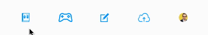
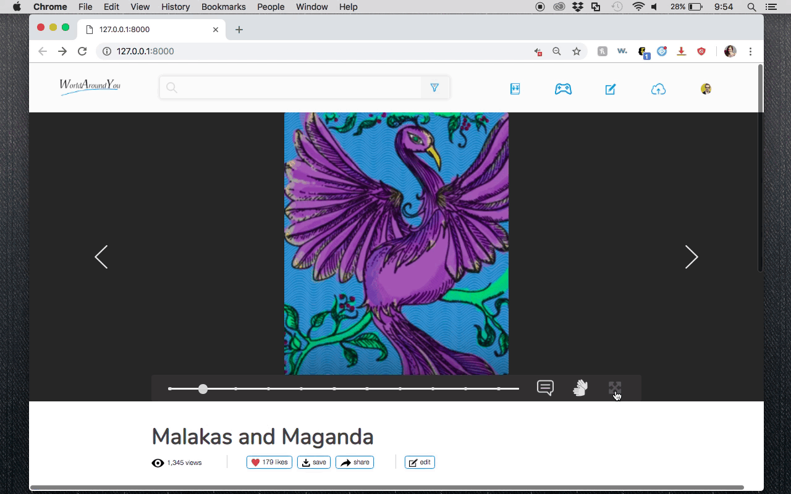

# World Around You

A digital library of stories, created collaboratively by Deaf and hearing people for Deaf children and their families, the school community, and the Deaf community. It is a web platform designed to make collaboration easy for uploading and editing contents for reading and viewing. It provides a space to watch, read, interact, like, share, comment, upload, and edit the contents. 

This repo holds the style guides, wireframes, and prototype implementation of the reader's view, beginning with Filipino Sign Language (FSL).

In the reader's view, each dot along the main slider bar represents a page in the story. Each page has 3 components, or sub-pages: 1) photo, 2) signed video, and 3) glossary interactivity. A sample story is shown in this prototype: "Malakas and Maganda." 

## Repo architecture

```
./
|
|_ css — stylesheets
    |_ fonts — font files
|
|_ img 
    |_ carousel — placeholder images for the "up next" and "from Massimo V." thumbnail carousels
    |_ glossary — placeholder images for sample vocabulary
    |_ icons — all icons used on the page
    |_ story_2 — photos from sample story "Malakas and Maganda" 
|
|_ js — scripts, including all dependencies (e.g. jQuery)
|
|_ readme_gifs — gifs for this README
|
|_ style guides & wireframes — designer's instructions
|
|_ text — temporary JSON database
|
|_ videos
    |_ fsl_luzon — signed videos from another sample story "The Lion and Mouse," repurposed to demonstrate switching sign languages within a story, e.g. the Filipino Sign Language Luzon regional dialect (but to clarify, the sign language in these videos is not FSL Luzon)
    |_ fsl_visayas — signed videos from the sample story "Malakas and Maganda"
```

## Operating instructions 

View demo at http://briennakh.me/world-around-you/.

However, GitHub serves large files with a lag. Videos are considered large files. For optimal performance, download repo and run on a local server such as `php -S localhost:4000`.

## Key functionalities

- After hovering over menu buttons for 0.5 seconds, a text description appears. Users often will stay that long on a button if they are uncertain what it does.



- Pagine through full story either using arrows or slider bar.
- Take entire panel fullscreen for an immersive user experience.



- Change written language at any point.
- On 1st page (after title page)
    - Change sign language. Limitation: Make sure you change back to FSL: Luzon before going to any other page. 
    - Click on glossary terms to view interactivity (video loop & photo corresponding to term). Click anywhere else on the screen to stop the video loop & return to original view. 
- Drag to slide video thumbnail carousels, and hover over thumbnails for interactivity. 

 

